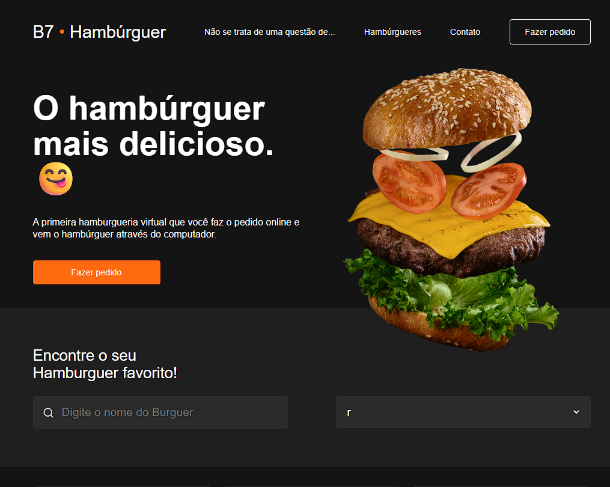

# 🍔 DB7Burger - Landing Page de Hamburgueria

Landing page responsiva de uma hamburgueria virtual, desenvolvida com HTML5 e CSS3, aplicando conceitos de desenvolvimento Front-End moderno, como Flexbox, CSS Grid e design responsivo.

O projeto foi criado com o objetivo de praticar conceitos fundamentais de desenvolvimento Front-End, como estruturação semântica, estilização avançada, Flexbox, CSS Grid e responsividade.

---

## Demonstração

Projeto desenvolvido para portfólio Front-End.




---

## Tecnologias utilizadas

- HTML5
- CSS3
- Flexbox
- CSS Grid
- Google Fonts
- Responsive Design

---

## Funcionalidades

✅ Layout responsivo para desktop, tablet e mobile

✅ Header com navegação e menu mobile

✅ Seção principal com chamada para ação

✅ Área de pesquisa de produtos

✅ Filtro de categorias

✅ Cards de produtos

✅ Footer personalizado

✅ Integração com WhatsApp

---

## Layout

O projeto possui uma interface moderna com foco em:

- experiência do usuário;
- organização visual;
- contraste e hierarquia de informações;
- adaptação para diferentes dispositivos.

---

## Estrutura do projeto

```
DB7Burger
│
├── index.html
│
├── assets
│ │
│ ├── style.css
│ ├── heroBurger.png
│ ├── searchIcon.png
│ │
│ ├── screenshots
│ │ └── db7burger-preview.png
│ │
│ └── burgers
│ ├── burger1.png
│ ├── burger2.png
│ ├── burger3.png
│ └── burger4.png
│
└── README.md
```

---

## Conceitos praticados

Durante o desenvolvimento foram aplicados:

- Estruturação de páginas com HTML semântico;
- Organização de estilos CSS;
- Uso de classes reutilizáveis;
- Layouts utilizando Flexbox;
- Construção de grids responsivos;
- Media Queries;
- Boas práticas de organização de código.

---

## Responsividade

O projeto foi desenvolvido pensando em diferentes tamanhos de tela:

📌 Desktop  
📌 Tablet  
📌 Smartphones  

---

## Melhorias futuras

Possíveis evoluções do projeto:

- Implementação de carrinho de compras;
- Filtro de produtos funcional;
- Integração com API;
- Sistema de pedidos online;
- Área administrativa.

## Projeto online

Acesse o projeto:

🔗 [DB7Burger](COLE_AQUI_SEU_LINK_DO_GITHUB_PAGES)

## Autor

Desenvolvido por **Darlan Alves**

🔗 LinkedIn: https://www.linkedin.com/in/darlanalvess/

📱 WhatsApp: [Darlan Alves](https://wa.me/5528999381528)

---

## 📄 Licença

Este projeto foi desenvolvido para fins de estudo e construção de portfólio.